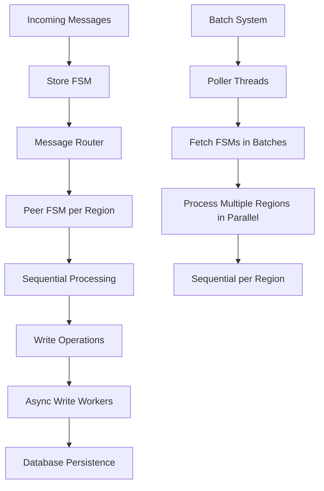

# TiKV RaftStore Thread Scheduling and Message Processing Analysis

## Table of Contents
1. [Overview](#overview)
2. [Architecture Components](#architecture-components)
3. [Thread Scheduling Model](#thread-scheduling-model)
4. [Message Processing Flow](#message-processing-flow)
5. [Write Ordering and Consistency](#write-ordering-and-consistency)
6. [Performance Optimizations](#performance-optimizations)
7. [Key Code Locations](#key-code-locations)
8. [Configuration Parameters](#configuration-parameters)
9. [Summary and Conclusions](#summary-and-conclusions)

## Overview

TiKV's RaftStore is a sophisticated distributed storage engine that implements the Raft consensus algorithm. One of its key design challenges is balancing **parallel processing for high throughput** with **sequential processing for consistency guarantees**. This document analyzes how TiKV achieves this balance through its thread scheduling and message processing architecture.

### Key Design Principles
- **Sequential processing per region**: Maintains Raft consensus ordering guarantees
- **Parallel processing across regions**: Enables high throughput and scalability
- **Batch processing**: Reduces overhead and improves cache locality
- **Dedicated worker threads**: Specialized handling for different operation types

## Architecture Components

### 1. Batch System (`components/batch-system/`)

The core of TiKV's message processing is built around a batch system that processes Finite State Machines (FSMs) in batches rather than individually.

**Key Files:**
- `components/batch-system/src/batch.rs` - Core batch processing logic
- `components/batch-system/src/fsm.rs` - FSM trait definitions
- `components/batch-system/src/scheduler.rs` - Message scheduling

**Core Types:**
```rust
pub struct BatchSystem<N: Fsm, C: Fsm> {
    name_prefix: Option<String>,
    router: BatchRouter<N, C>,
    receiver: Receiver<FsmTypes<N, C>>,
    low_receiver: Receiver<FsmTypes<N, C>>,
    pool_size: usize,
    max_batch_size: usize,
    workers: Arc<Mutex<Vec<JoinHandle<()>>>>,
    joinable_workers: Arc<Mutex<Vec<ThreadId>>>,
    reschedule_duration: Duration,
    low_priority_pool_size: usize,
}
```

### 2. RaftStore FSMs

**Store FSM** (`components/raftstore/src/store/fsm/store.rs`):
- Handles store-level operations
- Manages region routing and message distribution
- Processes store-level messages sequentially

**Peer FSM** (`components/raftstore/src/store/fsm/peer.rs`):
- Handles individual region/peer operations
- Processes peer-specific messages sequentially
- Maintains region state and Raft consensus

### 3. Worker Thread Pools

**Main Workers** (`components/raftstore-v2/src/batch/store.rs`):
```rust
struct Workers<EK: KvEngine, ER: RaftEngine> {
    async_read: Worker,                    // Async read operations
    pd: LazyWorker<pd::Task>,             // PD client tasks
    tablet: Worker,                       // Tablet operations
    checkpoint: Worker,                   // Checkpoint operations
    async_write: StoreWriters<EK, ER>,    // Write operations
    purge: Option<Worker>,                // Purge operations
    cleanup_worker: Worker,               // Cleanup tasks
    background: Worker,                   // Background tasks
    high_priority_pool: FuturePool,       // High-priority tasks
}
```

## Thread Scheduling Model

### 1. Poller-Based Processing

The batch system uses **pollers** that continuously fetch and process FSMs in batches:

```rust
// From components/batch-system/src/batch.rs:382-507
pub fn poll(&mut self) {
    let mut batch = Batch::with_capacity(self.max_batch_size);
    let mut reschedule_fsms = Vec::with_capacity(self.max_batch_size);
    
    while run && self.fetch_fsm(&mut batch) {
        // Process control FSM first
        if batch.control.is_some() {
            let len = self.handler.handle_control(batch.control.as_mut().unwrap());
            // Handle control FSM results
        }
        
        // Process normal FSMs (regions) in batch
        for (i, p) in batch.normals.iter_mut().enumerate() {
            let res = self.handler.handle_normal(p);
            // Handle normal FSM results
        }
        
        // Batch processing complete
        self.handler.end(&mut batch.normals);
    }
}
```

### 2. Message Collection and Processing

**Store-Level Message Handling:**
```rust
// From components/raftstore/src/store/fsm/store.rs:836-873
fn handle_msgs(&mut self, msgs: &mut Vec<StoreMsg<EK>>) {
    for m in msgs.drain(..) {
        distribution[m.discriminant()] += 1;
        match m {
            StoreMsg::Tick(tick) => self.on_tick(tick),
            StoreMsg::RaftMessage(msg) => {
                if !self.ctx.coprocessor_host.on_raft_message(&msg.msg) {
                    continue;
                }
                if let Err(e) = self.on_raft_message(msg) {
                    // Handle errors
                }
            }
            // ... other message types
        }
    }
}
```

**Peer-Level Message Handling:**
```rust
// From components/raftstore/src/store/fsm/peer.rs:645-673
for m in msgs.drain(..) {
    if self.fsm.stopped && !matches!(&m, PeerMsg::RaftCommand(_)) {
        continue;
    }
    distribution[m.discriminant()] += 1;
    match m {
        PeerMsg::RaftMessage(msg, sent_time) => {
            if let Some(sent_time) = sent_time {
                let wait_time = sent_time.saturating_elapsed().as_secs_f64();
                self.ctx.raft_metrics.process_wait_time.observe(wait_time);
            }
            
            if !self.ctx.coprocessor_host.on_raft_message(&msg.msg) {
                continue;
            }
            
            if let Err(e) = self.on_raft_message(msg) {
                // Handle errors
            }
        }
        PeerMsg::RaftCommand(cmd) => {
            // Process raft commands
        }
        // ... other message types
    }
}
```

## Message Processing Flow

### 1. Message Routing

Messages flow through the system in the following pattern:

1. **Incoming Messages** → **Store FSM** → **Router** → **Peer FSM**
2. **Peer FSM** processes messages sequentially per region
3. **Write Operations** → **Async Write Workers** → **Database**

### 2. Batch Processing Flow



### 3. Write Processing

**Async Write Worker** (`components/raftstore/src/store/async_io/write.rs`):
```rust
fn run(&mut self) {
    let mut stopped = false;
    while !stopped {
        let handle_begin = match self.receiver.recv() {
            Ok(msg) => {
                let now = Instant::now();
                stopped |= self.handle_msg(msg);
                now
            }
            Err(_) => return,
        };

        // Batch multiple messages
        while self.batch.get_raft_size() < self.raft_write_size_limit {
            match self.receiver.try_recv() {
                Ok(msg) => {
                    stopped |= self.handle_msg(msg);
                }
                Err(TryRecvError::Empty) => {
                    if self.batch.should_wait() {
                        self.batch.wait_for_a_while();
                        continue;
                    } else {
                        break;
                    }
                }
                Err(TryRecvError::Disconnected) => {
                    stopped = true;
                    break;
                }
            };
        }

        if self.batch.is_empty() {
            self.clear_latency_inspect();
            continue;
        }

        // Write to database
        self.write_to_db(true);
    }
}
```

## Write Ordering and Consistency

### 1. Per-Region Sequential Processing

**Critical Design Decision**: Each region's messages are processed sequentially to maintain Raft consensus ordering guarantees.

**Why Sequential per Region?**
- Raft consensus requires strict ordering of operations within each region
- Concurrent processing within a region could lead to inconsistent state
- Sequential processing ensures that log entries are applied in the correct order

### 2. Write Batching and Persistence

**Write Task Batching**:
```rust
// From components/raftstore/src/store/async_io/write.rs:543-581
fn add_write_task(&mut self, raft_engine: &ER, mut task: WriteTask<EK, ER>) {
    if let Err(e) = task.valid() {
        panic!("task is not valid: {:?}", e);
    }

    // Split large batches if needed
    if self.raft_wb_split_size > 0
        && self.raft_wbs.last().unwrap().persist_size() >= self.raft_wb_split_size
    {
        self.flush_states_to_raft_wb();
        self.raft_wbs.push(raft_engine.log_batch(RAFT_WB_DEFAULT_SIZE));
    }

    let raft_wb = self.raft_wbs.last_mut().unwrap();
    if let Some(wb) = task.raft_wb.take() {
        raft_wb.merge(wb).unwrap();
    }
    raft_wb
        .append(
            task.region_id,
            task.overwrite_to,
            std::mem::take(&mut task.entries),
        )
        .unwrap();
}
```

### 3. Apply Processing

**Apply Context** (`components/raftstore/src/store/fsm/apply.rs`):
```rust
pub fn prepare_for(&mut self, delegate: &mut ApplyDelegate<EK>) {
    self.applied_batch
        .push_batch(&delegate.observe_info, delegate.region.get_id());
    self.kv_wb.prepare_for_region(&delegate.region);
}

pub fn commit(&mut self, delegate: &mut ApplyDelegate<EK>) {
    if delegate.last_flush_applied_index < delegate.apply_state.get_applied_index() {
        delegate.maybe_write_apply_state(self);
    }
    self.commit_opt(delegate, true);
}
```

## Performance Optimizations

### 1. Batch Processing Benefits

- **Reduced Context Switching**: Process multiple messages per region in one batch
- **Better Cache Locality**: Related operations stay together in memory
- **Controlled Parallelism**: Balance between throughput and ordering guarantees
- **Efficient Resource Utilization**: Minimize thread creation/destruction overhead

### 2. Message Batching Strategy

**Configuration-Driven Batching**:
- `max_batch_size`: Maximum number of FSMs processed per batch
- `messages_per_tick`: Maximum messages processed per region per tick
- `raft_write_size_limit`: Maximum size for raft write batches

### 3. Thread Pool Management

**Specialized Workers**:
- **Async Read Workers**: Handle read operations asynchronously
- **Write Workers**: Dedicated threads for write operations
- **Background Workers**: Handle cleanup and maintenance tasks
- **High Priority Pool**: Critical operations that need immediate processing

## Key Code Locations

### Core Files

1. **Batch System**:
   - `components/batch-system/src/batch.rs` - Main batch processing logic
   - `components/batch-system/src/fsm.rs` - FSM trait definitions
   - `components/batch-system/src/scheduler.rs` - Message scheduling

2. **RaftStore FSMs**:
   - `components/raftstore/src/store/fsm/store.rs` - Store FSM implementation
   - `components/raftstore/src/store/fsm/peer.rs` - Peer FSM implementation
   - `components/raftstore/src/store/fsm/apply.rs` - Apply FSM implementation

3. **Write Processing**:
   - `components/raftstore/src/store/async_io/write.rs` - Async write workers
   - `components/raftstore/src/store/async_io/write_router.rs` - Write routing

4. **Thread Management**:
   - `components/raftstore-v2/src/batch/store.rs` - Worker thread definitions
   - `components/raftstore/src/store/worker/` - Various worker implementations

### Key Functions

1. **Message Processing**:
   - `StoreFsmDelegate::handle_msgs()` - Store-level message handling
   - `PeerFsmDelegate::handle_msgs()` - Peer-level message handling
   - `ApplyPoller::handle_normal()` - Apply message handling

2. **Batch Processing**:
   - `Poller::poll()` - Main batch processing loop
   - `BatchSystem::spawn()` - Start batch system workers

3. **Write Operations**:
   - `Worker::run()` - Async write worker main loop
   - `WriteTaskBatch::add_write_task()` - Add tasks to write batch
   - `ApplyContext::write_to_db()` - Persist changes to database

## Configuration Parameters

### Batch System Configuration

```rust
pub struct Config {
    pub max_batch_size: usize,           // Maximum FSMs per batch
    pub messages_per_tick: usize,        // Messages per region per tick
    pub reschedule_duration: Duration,   // Reschedule interval
    pub low_priority_pool_size: usize,   // Low priority thread pool size
}
```

### Write Configuration

```rust
pub struct WriteConfig {
    pub raft_write_size_limit: usize,    // Raft write batch size limit
    pub raft_write_batch_size_hint: usize, // Raft write batch hint
    pub raft_write_wait_duration: Duration, // Wait duration for batching
}
```

### Thread Pool Configuration

```rust
pub struct ThreadPoolConfig {
    pub async_read_worker_count: usize,  // Async read worker count
    pub write_worker_count: usize,       // Write worker count
    pub background_worker_count: usize,  // Background worker count
    pub high_priority_pool_size: usize,  // High priority pool size
}
```

## Summary and Conclusions

### Key Insights

1. **Hybrid Processing Model**: TiKV uses a sophisticated hybrid approach that combines sequential processing within regions (for consistency) with parallel processing across regions (for performance).

2. **Batch-First Design**: The entire system is designed around batch processing, which provides significant performance benefits while maintaining ordering guarantees.

3. **Specialized Workers**: Different types of operations are handled by specialized worker threads, allowing for optimized processing of different workloads.

4. **Configuration-Driven**: The system is highly configurable, allowing tuning for different workloads and hardware configurations.

### Design Trade-offs

**Advantages**:
- High throughput through parallel processing across regions
- Strong consistency guarantees through sequential processing within regions
- Efficient resource utilization through batch processing
- Scalable architecture that can handle many regions

**Challenges**:
- Complex thread coordination and synchronization
- Potential for head-of-line blocking within regions
- Configuration complexity for optimal performance tuning

### Best Practices

1. **Tune Batch Sizes**: Configure `max_batch_size` and `messages_per_tick` based on workload characteristics
2. **Monitor Thread Utilization**: Ensure worker threads are not underutilized or overloaded
3. **Balance Consistency vs Performance**: Understand the trade-offs between strict ordering and throughput
4. **Regular Performance Testing**: Continuously test and tune the system for your specific workload

This architecture demonstrates how TiKV successfully balances the competing demands of high performance and strong consistency in a distributed storage system, making it suitable for production workloads that require both high throughput and reliable data consistency.

---

*This document was generated by analyzing the TiKV codebase, specifically focusing on the RaftStore thread scheduling and message processing implementation. For the most up-to-date information, please refer to the official TiKV documentation and source code.*
